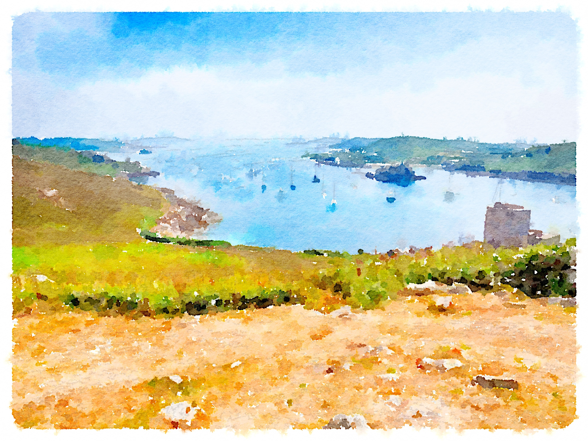

I needed some different/colourful images for the newly decorated loo wall :)

So - I picked up a recommendation for [waterlogue app](http://www.waterlogueapp.com/). Fun app - and surprisingly interesting results.

Here's the set of images I ended up with:

<link-flickr id="9427461001" title="Original: Puffins"></link-flickr>

<link-flickr id="9427459449" title="Original: Puffins"></link-flickr>

<link-flickr id="9427444951" title="Original: Porth Thomas Sunset"></link-flickr>

<link-flickr id="9437064862" title="Original: Samson from Porth Thomas"></link-flickr>

<link-flickr id="9427474921" title="Original: Buzza Skies"></link-flickr>

Finally one I didn't use as it was in black and white - from the trip home - Penzance station.

<link-flickr id="9434290255" title="Original: Penzance Station"></link-flickr>

So - I printed these out on heavyweight canvas (Canson Infinity PhotoArt HD Canvas 400) and framed them in 4 frames - each with three images.

And then - just a couple of quick iPhone shots showing them in place:

