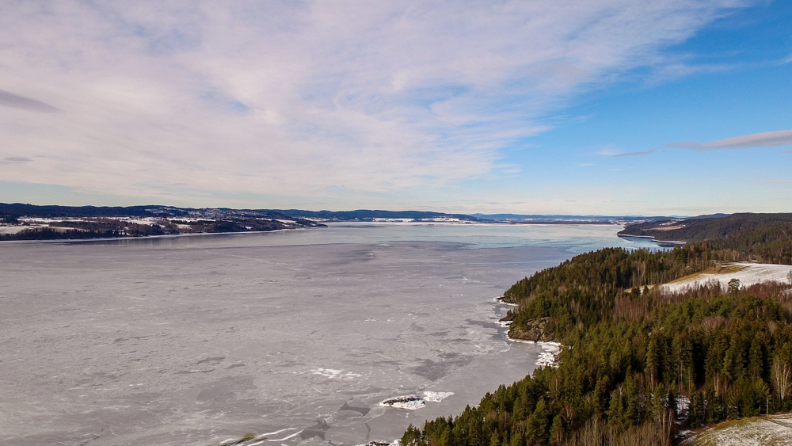

### Flying

Just having fun.

Three flights with video, one taking shots for a pano.

#### Flight Logs

- <%= flytrex_i1('yy1eFvwR', 'First video flight') %>
- <%= flytrex_i1('oPylBVwc', 'Pano flight') %>
- <%= flytrex_i1('J7WoKKEB', 'Second video flight') %>
- <%= flytrex_i1('oADg8j5U', 'Third video flight') %>

#### Video

<embed-youtube id="iUp4jZcpxlA"></embed-youtube>

#### Pano

  <a href="/static/2016/02/28/pano/">
      
       
       
      Panorama over Svarerud and Øyeren - click to view in panorama viewer.
  </a>

