When you have a family that is interested in horses, or when you have a family that has gone so far that they end up buying a horse, then you end up doing things you never expected to do :)

One of the small decorative fences used when building jumps was damaged. I said I'd take a look - and decided that it was actually easier just to replace the three pieces that were damaged rather than repair them in place (it would be a repair that would last longer).

So - I took the fence home along with a couple of planks that were lying loose on the damaged pallet pile.

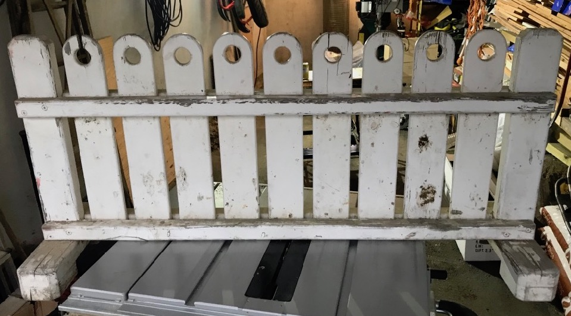

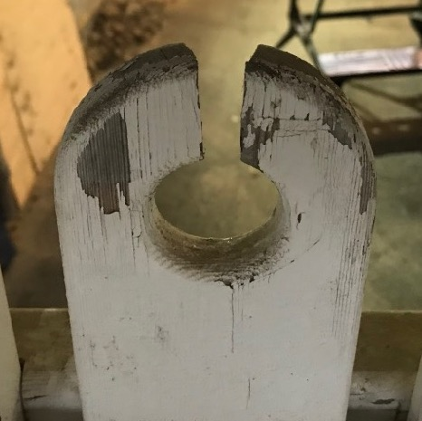

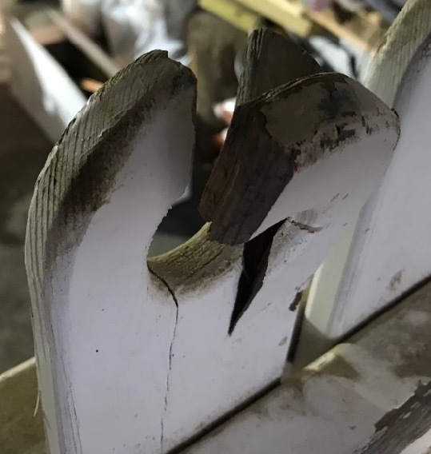

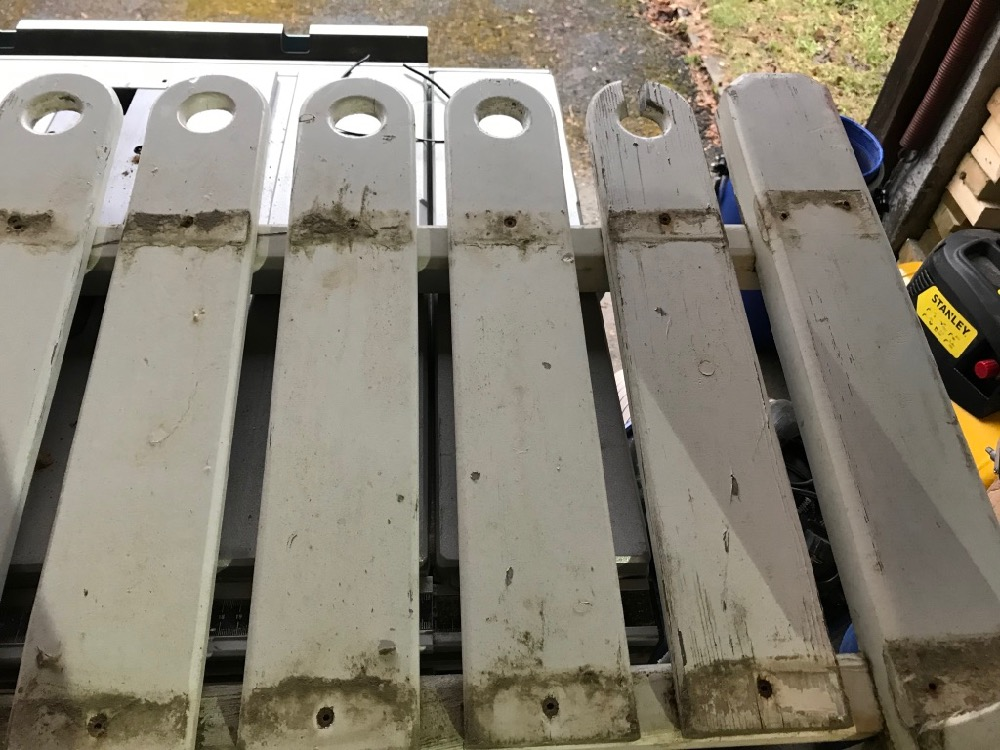

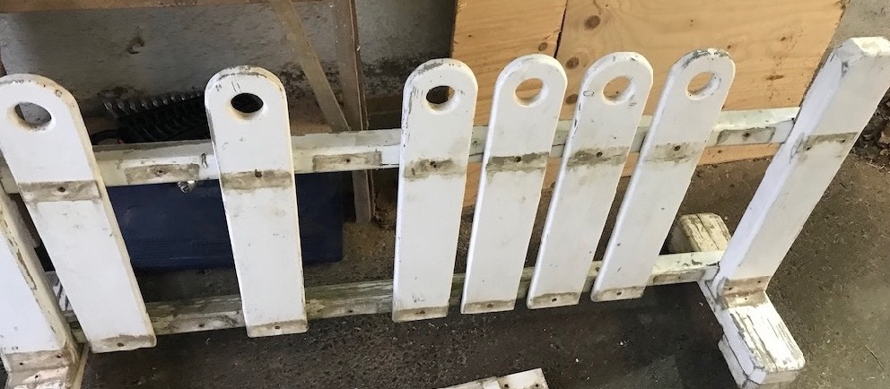

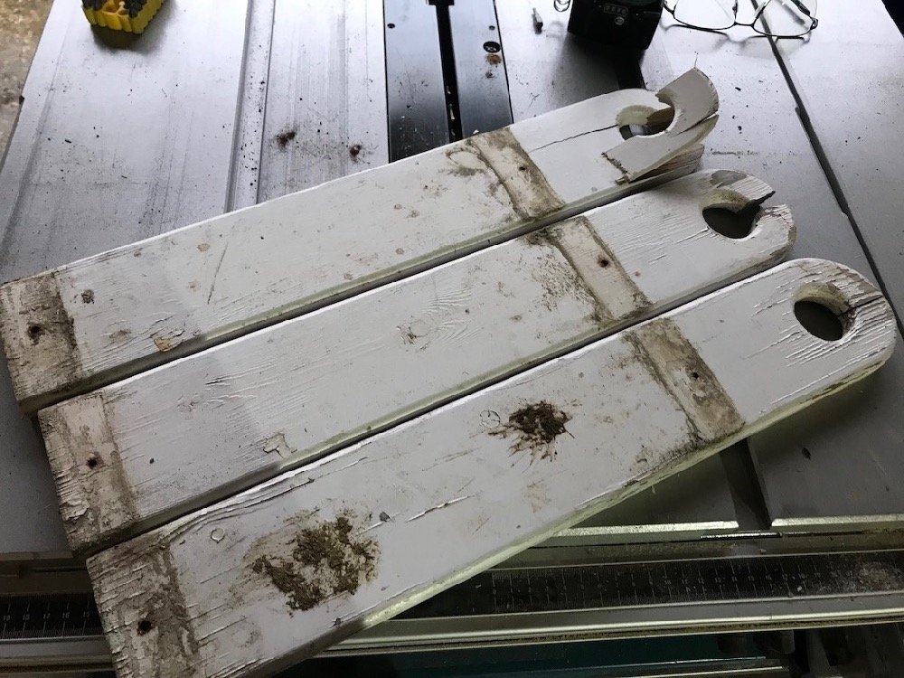

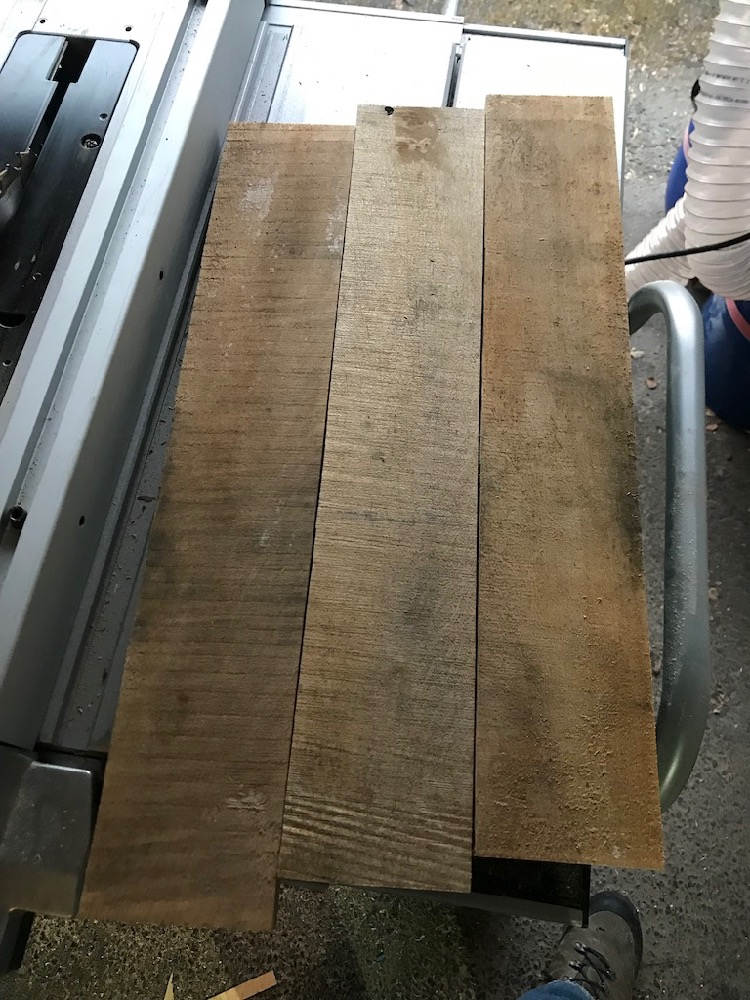

The two pieces of pallet wood were just enough to give me four lengths that could be used after the bits with nails in were removed.

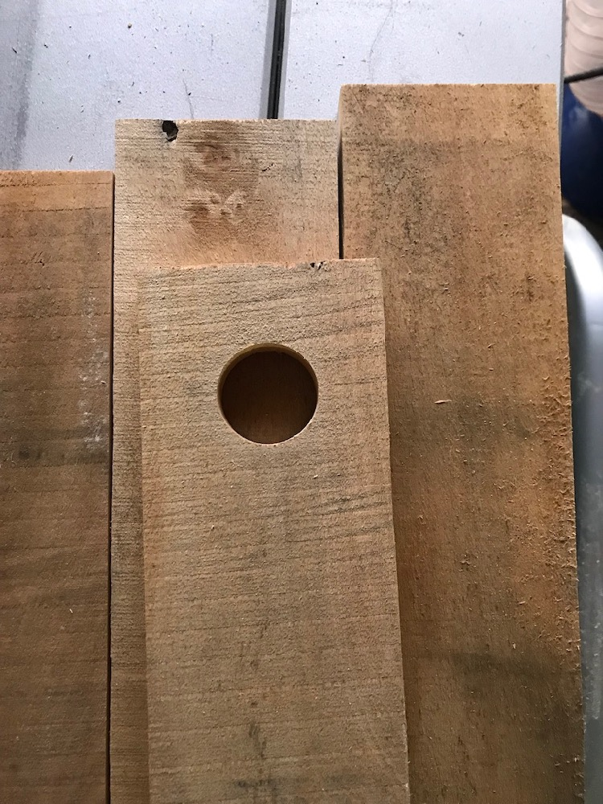

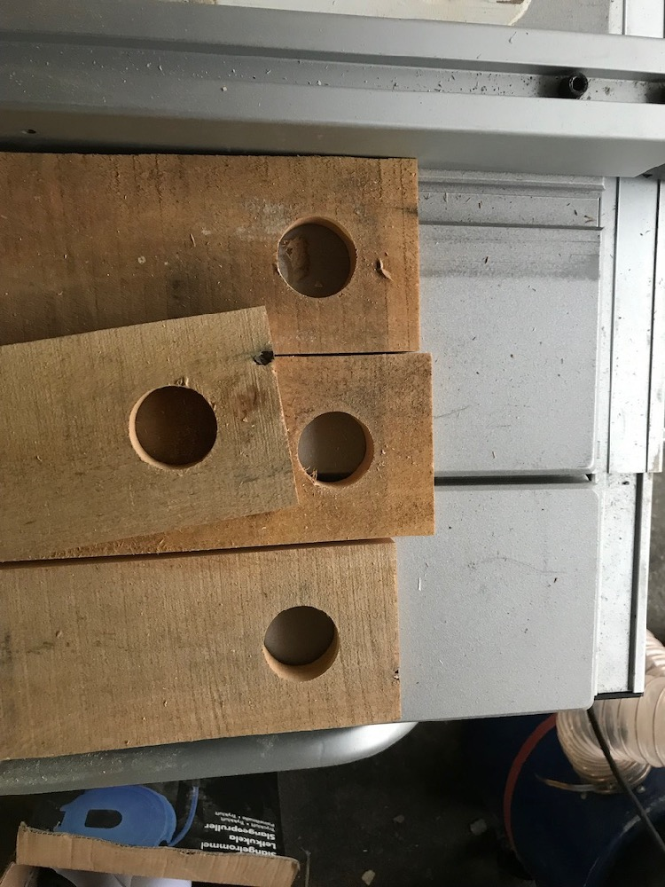

At this point - I still had one spare piece.

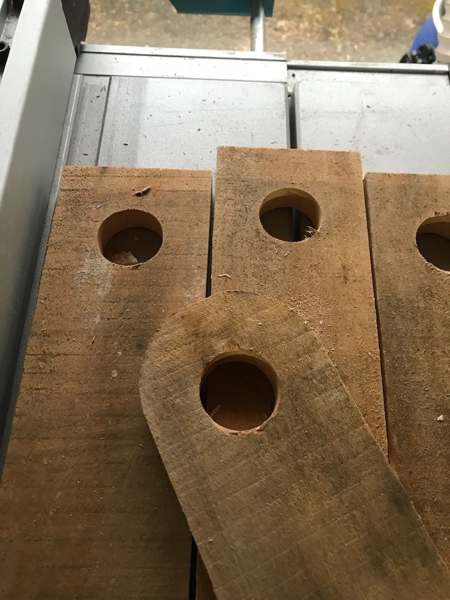

The round tops were done using an edge following router bit and one of the original parts.

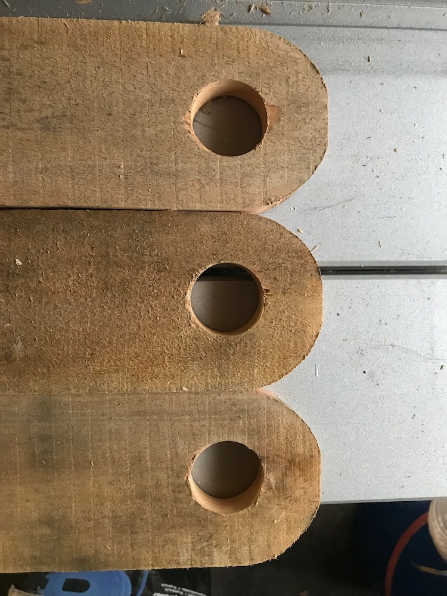

Good job I had one spare piece - the router bit gouged one of them. So - now there are just the right amount.

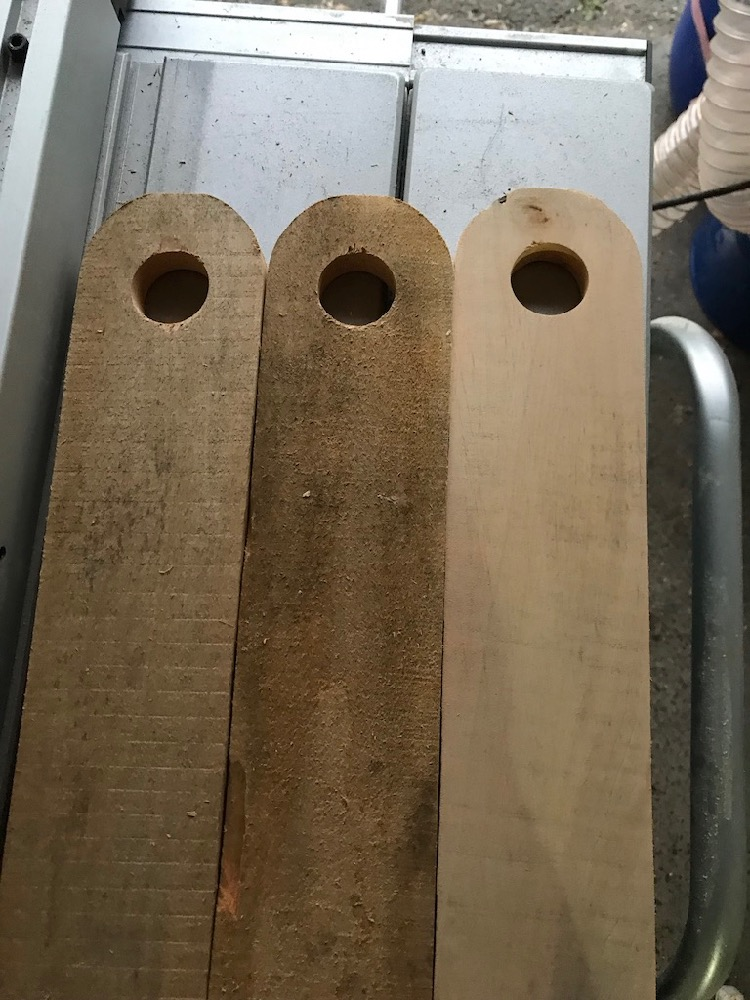

The pallet wood was a little thick and was also pretty rough so I blasted it with some 60 grit. Here you can see the difference.

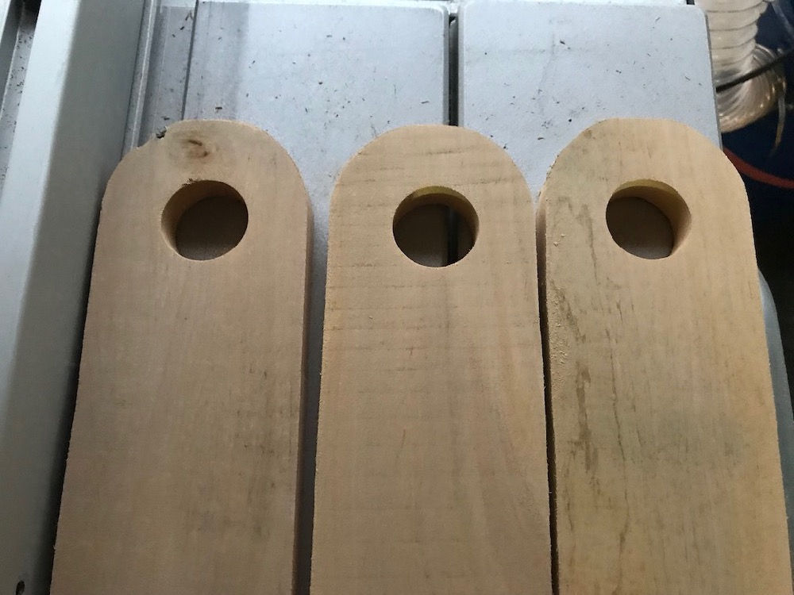

And now all three are sanded. 

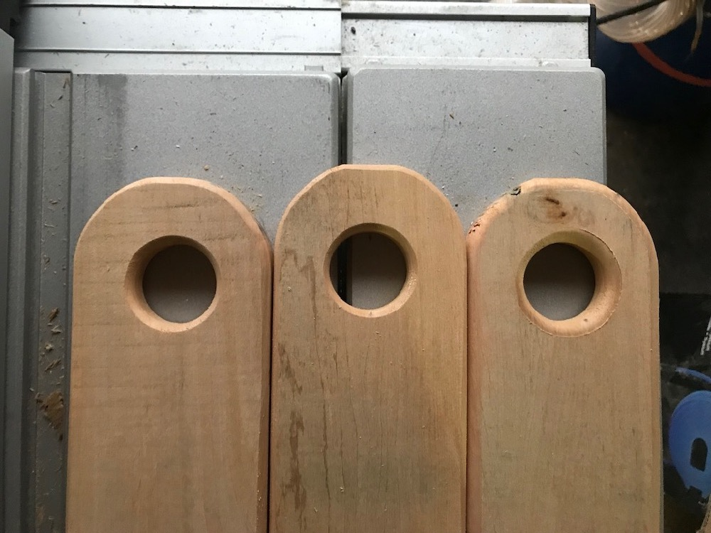

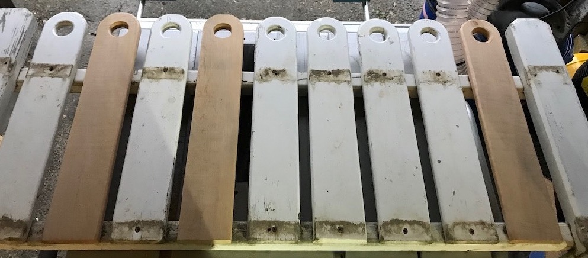

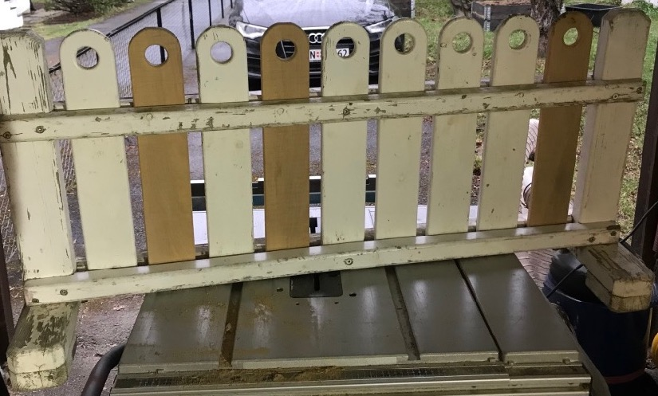

So - the final stage will be sanding down the whole thing and giving it some new paint.
